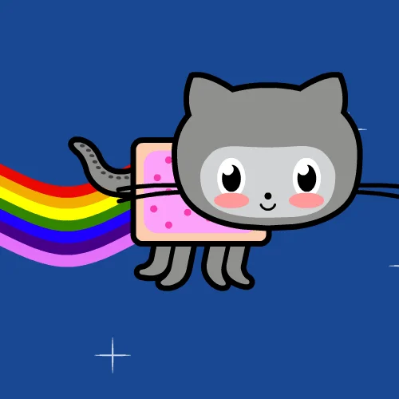

<p align="center">
  
</p>

# NEIGHBOW 🦄🌈

*ride your own rainbow*

My entry for [js13kGames 2026](https://js13kgames.com/2026/) — theme: **Unicorns and Rainbows**.

A one-button endless gallop. Your unicorn's horn casts a rainbow under its own hooves — hold to gallop **up** the rainbow as it forms, release and it levels off into a runway... and then it ends.

## How to play

- **HOLD** (tap / click / `Space` / `↑` / `W`) — ride the rainbow your horn casts, climbing as long as you hold
- **RELEASE** — the rainbow levels off and you keep riding (×2 star score) until it runs out beneath you
- Casting drains your rainbow meter — refill it on grass or by catching **stars**; you can also land on rainbows you cast earlier
- Star combos build while you stay off the grass — riding keeps the chain alive
- Dodge the grumpy **storm clouds**, don't fall into the void
- `M` mutes

## Build

```
npm install
node build.mjs
```

Outputs `dist/index.html` (self-contained) and `dist/game.zip`. The zip is the competition package — currently well under the 13,312-byte limit.

`index.html` in the repo root runs the unminified source (`src/game.js`) directly for development.

## Tech

Vanilla JS, one canvas, zero dependencies at runtime. Canvas-drawn everything (unicorn, terrain, sky cycle), procedural WebAudio music and SFX. Minified with terser, packed with roadroller.

---

by [@0xbl33p](https://x.com/0xbl33p)
